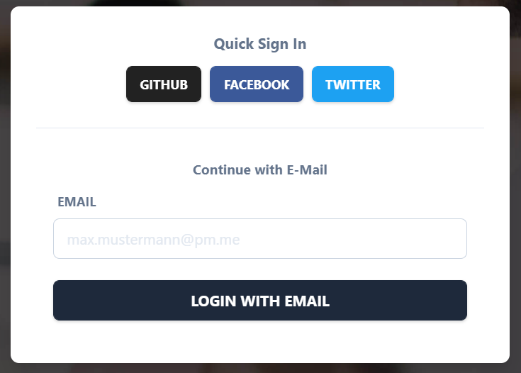

# Fitness Time - Workout Planer

A modern web application enabling users scheduling and organization of fitness activities.


### Prerequisites

The following applications should be installed before running this software.

```
Git
Yarn
```

### Authentication

For user authentication in the frontend the open source, customizable and gdpr-compliant authentication solution [NextAuth.js](https://next-auth.js.org/) is used.



#### Social Logins (oAuth Providers)

Several login mechanisms have been implemented through oAuth providers like GitHub, Facebook and Twitter. Users can use these Social logins to get into the web application really fast and without any hassle. The user will be redirect through 3-legged-oAuth to the social media provider like twitter and confirms the login there. Then the user is redirect to the application and logged in automatically. His data is stored within the `accounts` table in the database, containing information like the email, name, access_token and used provider. There is an error which seems to have not been thought through by NextAuth.js and cannot be fixed. When a user tries to sign in through different oAuth providers likes Twitter or Facebook and there uses the same email he will not be able to login through the last used social media. So a user has to stick to the first social media login and cannot change later anymore which is unfortunately.

#### Magic Link Email Login

Furthermore there is the option to login via email without a password. On first use an email will be sent to the user that contains a Verification Token that is valid for 24 hours and is stored in the database table `verification_request`. When used the user will be redirect and logged in automatically as well as his data will be stored within the `users` table containing information like his email.

This is a [Next.js](https://nextjs.org/) project bootstrapped with [`create-next-app`](https://github.com/vercel/next.js/tree/canary/packages/create-next-app).

## Getting Started

First, run the development server:

```bash
npm run dev
# or
yarn dev
```

Open [http://localhost:3000](http://localhost:3000) with your browser to see the result.

You can start editing the page by modifying `pages/index.js`. The page auto-updates as you edit the file.

[API routes](https://nextjs.org/docs/api-routes/introduction) can be accessed on [http://localhost:3000/api/hello](http://localhost:3000/api/hello). This endpoint can be edited in `pages/api/hello.js`.

The `pages/api` directory is mapped to `/api/*`. Files in this directory are treated as [API routes](https://nextjs.org/docs/api-routes/introduction) instead of React pages.

## Learn More

To learn more about Next.js, take a look at the following resources:

- [Next.js Documentation](https://nextjs.org/docs) - learn about Next.js features and API.
- [Learn Next.js](https://nextjs.org/learn) - an interactive Next.js tutorial.

You can check out [the Next.js GitHub repository](https://github.com/vercel/next.js/) - your feedback and contributions are welcome!

## Deploy on Vercel

The easiest way to deploy your Next.js app is to use the [Vercel Platform](https://vercel.com/new?utm_medium=default-template&filter=next.js&utm_source=create-next-app&utm_campaign=create-next-app-readme) from the creators of Next.js.

Check out our [Next.js deployment documentation](https://nextjs.org/docs/deployment) for more details.
