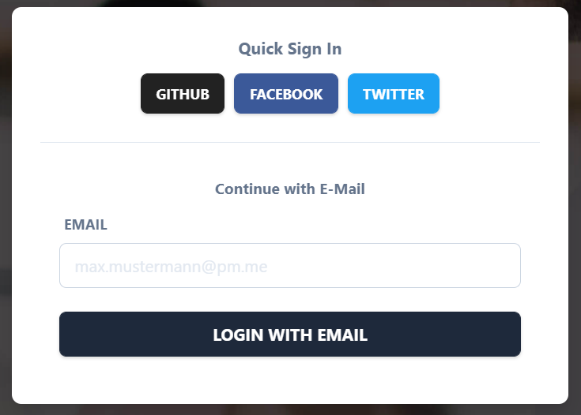

# 🏋️ Fitness Time - Workout Planner Frontend


A modern web application enabling users scheduling and organization of fitness activities.

[VISIT LIVE DEMO](https://www.fitness-time.app)


## ✨ Features

- Modern Landing page with [Animate on Scroll](https://www.npmjs.com/package/aos) animations
- Contact us via email
- Language Support for german and english
- Responsiveness optimized for desktop, tablet and mobile devices
- JWT token based authentication via oAuth providers like GitHub, Facebook and Twitter for quick SignIn
- Alternative fallback magic URL email login
- Custom [Error](https://www.fitness-time.app/error), [404](https://www.fitness-time.app/404) and [Email sent](https://www.fitness-time.app/auth/mailsent) page
- Continuous Integration/Continuous Deployment Pipeline through [Vercel](https://vercel.com/)

## 🤖 Technologies

## ⏹️ Prerequisites

The following applications should be installed before running this software.

```
Git
Yarn
```

### Environment Variables

There are some environment variables needed weither the application should be run locally or in deployment.

```bash
GITHUB_ID=<3-legged oAUTH ID here>
GITHUB_SECRET=<3-legged oAUTH SECRET here>
FACEBOOK_ID=<3-legged oAUTH ID here>
FACEBOOK_SECRET=<3-legged oAUTH SECRET here>
TWITTER_ID=<3-legged oAUTH ID here>
TWITTER_SECRET=<3-legged oAUTH SECRET here>

EMAIL_SERVER_USER=<Email SMTP username here>
EMAIL_SERVER_PASSWORD=<Email SMTP password here>
EMAIL_SERVER_HOST=<Email SMTP host here>
EMAIL_SERVER_PORT=<Email SMTP port here>
EMAIL_FROM=<Mail adress that should appear as sender here>

DATABASE_URL=<Database URL connection string here>

NEXTAUTH_URL=<Domain/base url of the project here>
SECRET=<https://generate-secret.vercel.app/32 Secret here>
JWT_SECRET=<Long Secret to sign JWT with here>

```

## 📝 Authentication

For user authentication in the frontend the open source, customizable and gdpr-compliant authentication solution [NextAuth.js](https://next-auth.js.org/) is used.



#### Social Logins (oAuth Providers)

Several login mechanisms have been implemented through oAuth providers like GitHub, Facebook and Twitter. Users can use these Social logins to get into the web application really fast and without any hassle. The user will be redirect through 3-legged-oAuth to the social media provider like twitter and confirms the login there. Then the user is redirect to the application and logged in automatically. His data is stored within the `accounts` table in the database, containing information like the email, name, access_token and used provider. There is an error which seems to have not been thought through by NextAuth.js and cannot be fixed. When a user tries to sign in through different oAuth providers likes Twitter or Facebook and there uses the same email he will not be able to login through the last used social media. So a user has to stick to the first social media login and cannot change later anymore which is unfortunately.

#### Magic Link Email Login

Furthermore there is the option to login via email without a password. On first use an email will be sent to the user that contains a Verification Token that is valid for 24 hours and is stored in the database table `verification_request`. When used the user will be redirect and logged in automatically as well as his data will be stored within the `users` table containing information like his email. Email can also be used when a user has used an oAuth provider like GitHub, Twitter or Facebook with the same email before and maybe lost access. So it acts as a backup mechanism and the corresponding user account should be succesfully linked when used email instead of oAuth. Trough the selected technical login mechanism the CSRF token will be set automatically.

This is a [Next.js](https://nextjs.org/) project bootstrapped with [`create-next-app`](https://github.com/vercel/next.js/tree/canary/packages/create-next-app).

#### Email Provider

For sending emails for authentication reasons the service [Mailjet](https://app.mailjet.com) is used. It offers easy and free access to sending out 100 emails per hour which should be enough for this university demo project. If it should ever go into real work production another SMTP service provider or an account upgrade can be used.

## 🎨 Design

The design was inspired by

For the color palette the colors xx yy were chosen

## 🏗️ Architecture & Design decisions

### Workouts and Assigned Workouts

Users can create individual workouts for themselves. From a architecture perspective there is a slight difference between workouts as they are and workouts which are assigned from a user and which data is saved where.

#### Workouts

Workouts are saved within the `workouts` table in the database. Elementary information about them are stored there which can be edited by the user in the specific view for that. These workouts act as building blocks that can be placed within many weeklyworkoutplans simultaneously. Thus it does not makes sense to store certain info in this table that belongs only to one individual weeklyworkoutplan for this workout but not to others like if it was completed in this week or at which time it starts and ends.

#### Assigned Workouts

To differentiate between workouts and workouts assigned into a specific weeklyworkoutplan extra information about a specific workout within this single week is stores within the `weekly_workout_plans` table in the JSON data of a specific day like `day_1`. Such data is weither this assigned workout was completed at which time it is scheduled to start and end and how long it took a user in reality.

#### Downsides & Known Bugs

## Getting Started

First, run the development server:

```bash
npm run dev
# or
yarn dev
```

Open [http://localhost:3000](http://localhost:3000) with your browser to see the result.

You can start editing the page by modifying `pages/index.js`. The page auto-updates as you edit the file.

[API routes](https://nextjs.org/docs/api-routes/introduction) can be accessed on [http://localhost:3000/api/hello](http://localhost:3000/api/hello). This endpoint can be edited in `pages/api/hello.js`.

The `pages/api` directory is mapped to `/api/*`. Files in this directory are treated as [API routes](https://nextjs.org/docs/api-routes/introduction) instead of React pages.

## Learn More

To learn more about Next.js, take a look at the following resources:

- [Next.js Documentation](https://nextjs.org/docs) - learn about Next.js features and API.
- [Learn Next.js](https://nextjs.org/learn) - an interactive Next.js tutorial.

You can check out [the Next.js GitHub repository](https://github.com/vercel/next.js/) - your feedback and contributions are welcome!

## Deploy on Vercel

The easiest way to deploy your Next.js app is to use the [Vercel Platform](https://vercel.com/new?utm_medium=default-template&filter=next.js&utm_source=create-next-app&utm_campaign=create-next-app-readme) from the creators of Next.js.

Check out our [Next.js deployment documentation](https://nextjs.org/docs/deployment) for more details.
