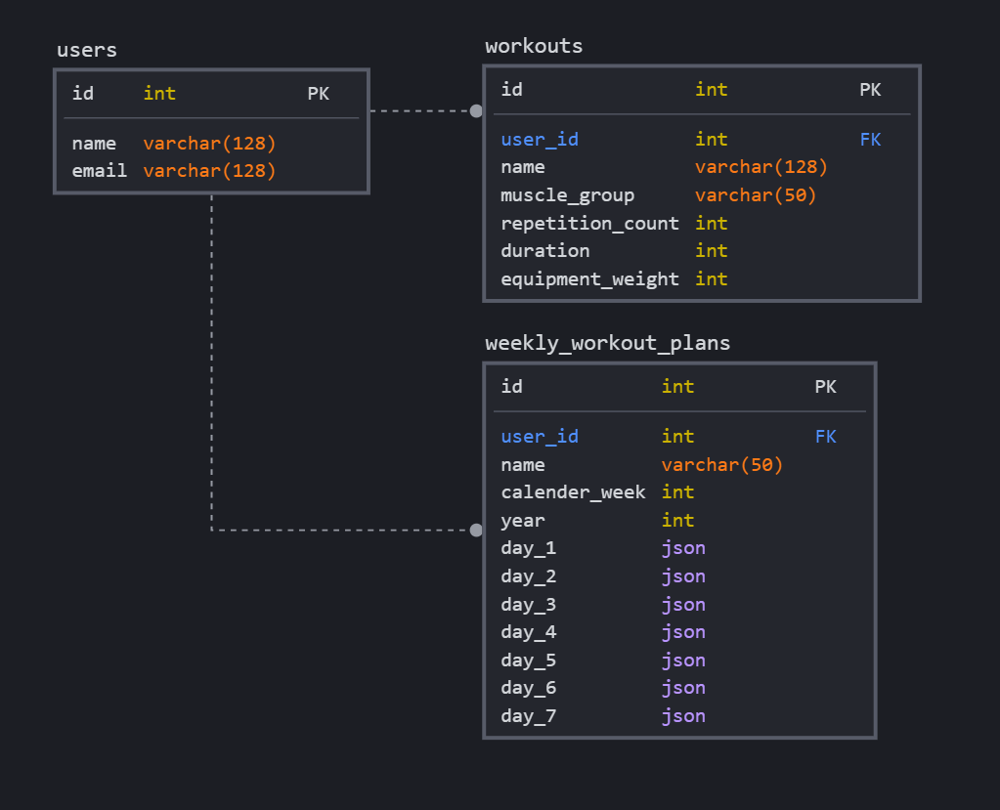

# Fitness Time - Workout Planer

A modern web application enabling users scheduling and organization of fitness activities.


### Prerequisites

The following applications should be installed before running this software.

```
Git
Yarn
```

This is a [Next.js](https://nextjs.org/) project bootstrapped with [`create-next-app`](https://github.com/vercel/next.js/tree/canary/packages/create-next-app).

## Getting Started

First, run the development server:

```bash
npm run dev
# or
yarn dev
```

Open [http://localhost:3000](http://localhost:3000) with your browser to see the result.

You can start editing the page by modifying `pages/index.js`. The page auto-updates as you edit the file.

[API routes](https://nextjs.org/docs/api-routes/introduction) can be accessed on [http://localhost:3000/api/hello](http://localhost:3000/api/hello). This endpoint can be edited in `pages/api/hello.js`.

The `pages/api` directory is mapped to `/api/*`. Files in this directory are treated as [API routes](https://nextjs.org/docs/api-routes/introduction) instead of React pages.

## Learn More

To learn more about Next.js, take a look at the following resources:

- [Next.js Documentation](https://nextjs.org/docs) - learn about Next.js features and API.
- [Learn Next.js](https://nextjs.org/learn) - an interactive Next.js tutorial.

You can check out [the Next.js GitHub repository](https://github.com/vercel/next.js/) - your feedback and contributions are welcome!

## Development & Ideas

### Database Architecture



**users** <br>
Since the authentication process is handled through Next-Auth.js with magic links for social media login and email magic links there is not a lot of data gathered from the users, only email and if social media is used also the name.

**workouts** <br>
Users should be able to create custom workouts but also can select already created example workouts for themself. Only workout attributes and a foreign key to the user owning them is stored.

**weekly_workout_plans** <br>
During the design architecture some discussion about granularity came up but consensus was that each workoutplan is consisting of 7 possible workout days, a name, a year and which calender week it represents. In the backend users can be searched for all of their weekly_workout_plans and them sent to the frontend to be displayed in a calender view accordingly to their week. For each day there will be a json containing information about the individual workouts like tracking their completing, the real invested time, the scheduled time each of them should happen for the day and the id of the workout similar to this example:

```json
  "day_1": {
    { "workout_id": "17",
      "workout_completed": "no",
      "workout_tracked_time": "0",
      "workout_time_start": "13:00",
      "workout_time_end": "13:30"
    },
    { "workout_id": "24",
      "workout_completed": "no",
      "workout_tracked_time": "0",
      "workout_time_start": "13:30",
      "workout_time_end": "13:45"
    }
  },
  "day_2": {
    { "workout_id": "13",
      "workout_completed": "no",
      "workout_tracked_time": "0",
      "workout_time_start": "11:00",
      "workout_time_end": "12:00"
    },
  },
  "day_3": {},
  "day_4": {},
  "day_5": {},
  "day_6": {},
  "day_7": {}
```

## Deploy on Vercel

The easiest way to deploy your Next.js app is to use the [Vercel Platform](https://vercel.com/new?utm_medium=default-template&filter=next.js&utm_source=create-next-app&utm_campaign=create-next-app-readme) from the creators of Next.js.

Check out our [Next.js deployment documentation](https://nextjs.org/docs/deployment) for more details.
