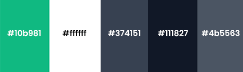

# 🏋️ Fitness Time - Workout Planner Frontend


A modern web application enabling users scheduling and organization of fitness activities.

[VISIT LIVE DEMO](https://www.fitness-time.app)


## ✨ Features

- CRUD for workouts

- CRUD for weekly workout plans

- Add, View, Update, Remove assigned workouts within their weekly workout plan

- Various filters and search functionalities

- Some CRUD for users based on authorization role

- Different functionality for role user and admin

- Language support for German and English

- Contact us via email

## 🤖 Tech

- Modern client-side frontend based on [React.js](https://reactjs.org) through [Next.JS](https://nextjs.org) framework with a tiny integrated serverless backend

- Modern styling with the help of the utility-first CSS framework [Tailwind CSS](https://tailwindcss.com) with activated [JIT (Just-In-Time-Compiler)](https://tailwindcss.com/docs/just-in-time-mode)

- Continuous Integration/Continuous Deployment pipeline through [Vercel](https://vercel.com)

- Implemented three authentication mechanisms using [NextAuth](https://next-auth.js.org)

  - JWT token based authentication via oAuth providers like GitHub, Facebook and Twitter for quick SignIn

  - Alternative fallback magic URL email login

  - Admin login via custom backend authentication using username and salted + hashed password

- GDPR compliant cookie consent banner achieved with [js-cookie](https://www.npmjs.com/package/js-cookie)

- SEO & compatibility for OpenGraph through [Next SEO](https://www.npmjs.com/package/next-seo)

## 🎨 UI

- Modern landing page with [Animate on Scroll](https://www.npmjs.com/package/aos) animations

- Responsiveness optimized for desktop, tablet and mobile devices

- Color Palette
  

  - accent color lightseagreen (#10b981)
  - font color white (#ffffff)
  - primary background color darkslategray (#374151)
  - secondary background color black (#111827)
  - input background color darkslategray (#4b5563)

- Custom [Error](https://www.fitness-time.app/error), [404](https://www.fitness-time.app/404) and [Email sent](https://www.fitness-time.app/auth/mailsent) page

## ⏹️ Prerequisites

The following applications should be installed before running this software.

```bash
Git
Yarn
Node
```

## 🔧 Environment Variables

There are some environment variables needed weither the application should be run locally or in deployment.

```bash
GITHUB_ID=<3-legged oAUTH ID here>
GITHUB_SECRET=<3-legged oAUTH SECRET here>
GITHUB_WEBSITE_ID=<GitHub website id here>
GITHUB_WEBSITE_SECRET=<GitHub website secret here>
FACEBOOK_ID=<3-legged oAUTH ID here>
FACEBOOK_SECRET=<3-legged oAUTH SECRET here>
TWITTER_ID=<3-legged oAUTH ID here>
TWITTER_SECRET=<3-legged oAUTH SECRET here>

EMAIL_SERVER_USER=<Email SMTP username here>
EMAIL_SERVER_PASSWORD=<Email SMTP password here>
EMAIL_SERVER_HOST=<Email SMTP host here>
EMAIL_SERVER_PORT=<Email SMTP port here>
EMAIL_FROM=<Mail adress that should appear as sender here>

DATABASE_URL=<Database URL connection string here>

NEXTAUTH_URL=<Domain/base url of the project here>
SECRET=<https://generate-secret.vercel.app/32 Secret here>
JWT_SECRET=<Long Secret to sign JWT with here>

NEXT_PUBLIC_BACKEND_URL=<http://localhost:5000/v1>

```

## 📝 Authentication

For user authentication in the frontend the open source, customizable and gdpr-compliant authentication solution [NextAuth.js](https://next-auth.js.org/) is used.


### Social Logins (oAuth Providers)

Several login mechanisms have been implemented through oAuth providers like GitHub, Facebook and Twitter. Users can use these Social logins to get into the web application really fast and without any hassle. The user will be redirect through 3-legged-oAuth to the social media provider like twitter and confirms the login there. Then the user is redirect to the application and logged in automatically. His data is stored within the `accounts` table in the database, containing information like the email, name, access_token and used provider. There is an error which seems to have not been thought through by NextAuth.js and cannot be fixed. When a user tries to sign in through different oAuth providers likes Twitter or Facebook and there uses the same email he will not be able to login through the last used social media. So a user has to stick to the first social media login and cannot change later anymore which is unfortunately.

### Magic Link Email Login

Furthermore there is the option to login via email without a password. On first use an email will be sent to the user that contains a Verification Token that is valid for 24 hours and is stored in the database table `verification_request`. When used the user will be redirect and logged in automatically as well as his data will be stored within the `users` table containing information like his email. Email can also be used when a user has used an oAuth provider like GitHub, Twitter or Facebook with the same email before and maybe lost access. So it acts as a backup mechanism and the corresponding user account should be succesfully linked when used email instead of oAuth. Trough the selected technical login mechanism the CSRF token will be set automatically.

### Username and Password custom authentication

To explore the NextAuth.js library more in depth and to fulfill the requirements of this project another login method was implemented for username and password. Admins can use this login mechanism by using the [Admin Login Page](https://www.fitness-time.app/auth/adminlogin) To learn more about how this was implemented lookup the documentation of [WebMo21 Backend](https://github.com/WebMo21/webmo21-backend/blob/main/README.md)

## 📫 Email Provider

For sending emails for authentication reasons the service [Mailjet](https://app.mailjet.com) is used. It offers easy and free access to sending out 100 emails per hour which should be enough for this university demo project. If it should ever go into real work production another SMTP service provider or an account upgrade can be used.

## 🏗️ Architecture & Design decisions

### File Structure

- /components
  - Contains modular and reusable components with state logic that return JSX code to be converted to HTML for displaying it in views.
  - Subfolders group different component files into their corresponding context.
- /pages
  - Contains files which are representing views that use modular components in them
  - \_app.js
    - Contains default configuration for all views like animate on scroll settings or providing information about the users JWT session data through the React Context API
  - /api
    - Contains configuration and model settings for NextAuth authentication which are executed server-side in deployed serverless functions as a tiny backend
  - /auth
    - Contains views that handle authentication like different login or logout views
- /public
  - Contains media and resources that will be used for static file serving in the root directory of the deployed production website.
  - Images are grouped within their contextual folders
- /styles
  - Contains .css files to be used for styling the website.
  - Tailwind with activated Just-In-Time-Compiler (JIT) will inject only the necessary and purged CSS definitions on the fly to keep production size as minimal as possible

#### Downsides & Known Bugs

## Getting Started

First, run the development server:

```bash
npm run dev
# or
yarn dev
```

Open [http://localhost:3000](http://localhost:3000) with your browser to see the result.

You can start editing the page by modifying `pages/index.js`. The page auto-updates as you edit the file.

[API routes](https://nextjs.org/docs/api-routes/introduction) can be accessed on [http://localhost:3000/api/hello](http://localhost:3000/api/hello). This endpoint can be edited in `pages/api/hello.js`.

The `pages/api` directory is mapped to `/api/*`. Files in this directory are treated as [API routes](https://nextjs.org/docs/api-routes/introduction) instead of React pages.

## Learn More

To learn more about Next.js, take a look at the following resources:

- [Next.js Documentation](https://nextjs.org/docs) - learn about Next.js features and API.
- [Learn Next.js](https://nextjs.org/learn) - an interactive Next.js tutorial.

You can check out [the Next.js GitHub repository](https://github.com/vercel/next.js/) - your feedback and contributions are welcome!

## Deploy on Vercel

The easiest way to deploy your Next.js app is to use the [Vercel Platform](https://vercel.com/new?utm_medium=default-template&filter=next.js&utm_source=create-next-app&utm_campaign=create-next-app-readme) from the creators of Next.js.

Check out our [Next.js deployment documentation](https://nextjs.org/docs/deployment) for more details.

## 🗼 Future Functionality

The next features which should be implemented are:

- Profile Picture File Upload
- Start and Track Workout Live View (Play Button in Navigation)
- More calendar interactions like drag and drop to reschedule a training plan or create a series of weekly training plans for a given time period

## 👨 Team

|  |  |  |    |
| ------------------------------------------- | --------------------------------------------- | --------------------------------------------- | -------------------------------------------------- |
| Jakob Holz                                  | Onur Menekse                                  | Artur Kamrad                                  | [Sascha Majewsky](https://github.com/SaschaWebDev) |
